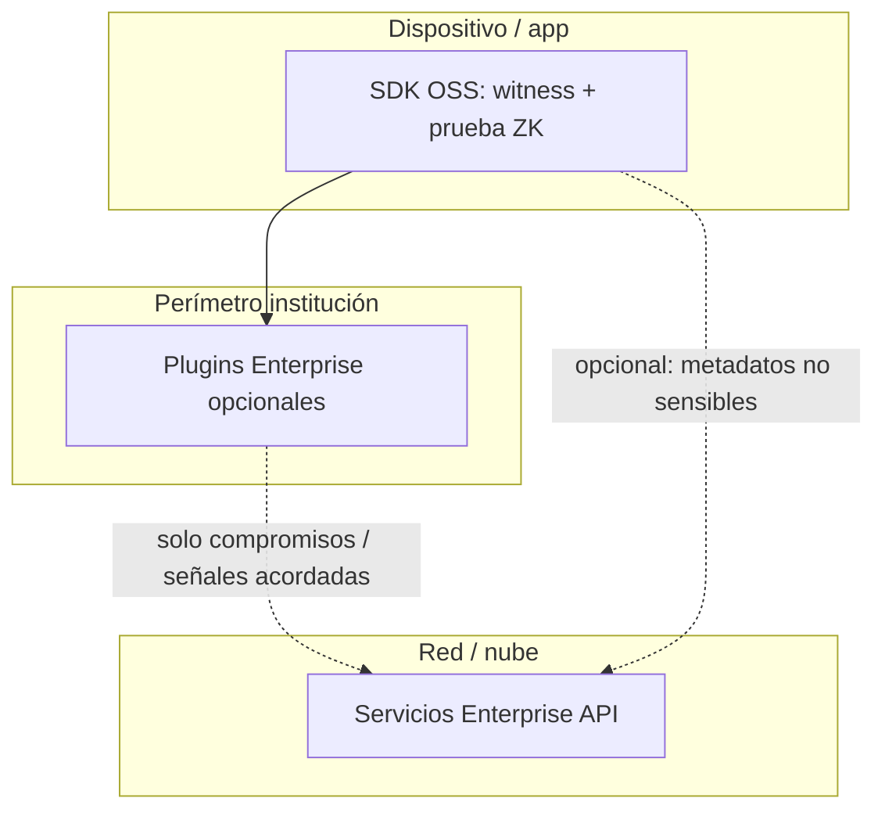

# Modelo de integración Open Source + Enterprise

Este documento describe **cómo se combinan** dos enfoques de integración entre el **SDK Fortgate ID de código abierto** (`open/client-sdk`, circuitos, pruebas ZK) y los **servicios y módulos Enterprise** (operación para bancos, fintech e instituciones). El objetivo es que el core sea **auditable, forkeable e implementable** por cada institución o por la comunidad ZK, mientras la capa Enterprise aporta valor comercial **sin sustituir** la privacidad ni la verificabilidad del núcleo abierto.

---

## Principios

| Principio | Significado práctico |
|-----------|----------------------|
| **Separación de preocupaciones** | Criptografía, circuitos y flujo de prueba viven en el repo **open**; scoring avanzado, informes regulatorios, anti‑spoofing operativo y SLAs viven en **Enterprise** (plugins y/o APIs). |
| **Privacidad en el core** | Un usuario o auditor puede razonar sobre “full privacy” revisando el OSS. Enterprise **no debe** ser obligatorio para completar una prueba ZK válida en el dispositivo. |
| **Contratos estables hacia fuera** | El OSS expone interfaces documentadas (UDL/FFI/WASM, IO del programa SP1, vectores de prueba). Enterprise se acopla a **releases versionadas**, no a forks opacos del core. |
| **Doble pista de auditoría** | Los auditores revisan el **artefacto OSS** (código + builds reproducibles). Los servicios Enterprise se auditan como **producto y procesos** aparte (APIs, datos que entran/salen, retención). |

---

## Dimensión 1 — Plugins y contratos inyectables (local / build-time)

**Idea:** El SDK público define **contratos estables** (por ejemplo traits, callbacks o paquetes con API fijada: “proveedor de verificación de atestación”, “adaptador de informes internos”). Los módulos Enterprise se distribuyen como **artefactos privados** (crates internos, AAR, paquetes npm nativos o bins firmados) que **implementan** esas interfaces.

**Características:**

- La comunidad y las instituciones compilan y auditan el **mismo árbol OSS** sin dependencias cerradas por defecto.
- Un banco puede enlazar un plugin Enterprise **solo en su pipeline de build** o mediante inyección de dependencias acordada con el vendor.
- Los plugins deben documentar **qué datos pueden solicitar**; lo recomendable es limitar la superficie a **compromisos (hashes)**, metadatos no sensibles o señales ya agregadas, salvo acuerdo explícito y revisión de cumplimiento.

**Rol en el modelo combinado:** cubre integración **dentro del perímetro del cliente** (datos que no deben salir a internet, políticas internas, HSM, core banking).

---

## Dimensión 2 — Servicios en red (sidecar / SaaS / API institucional)

**Idea:** Parte del valor Enterprise se entrega como **servicios remotos**: APIs en la nube del vendor, microservicios en la red del banco o colas de trabajo. La app del usuario final sigue usando el **SDK OSS** para generar el witness y la prueba; los servicios Enterprise reciben solo lo que la institución **elige enviar** (por ejemplo puntuaciones de riesgo agregadas, IDs de correlación, hashes de sesión).

**Características:**

- **No** sustituyen al core: la prueba ZK puede completarse sin llamar a la API Enterprise.
- Encajan con SLAs, informes XAI, dashboards y reglas de negocio que cambian con frecuencia sin republicar el SDK.
- Los diagramas de flujo de datos para auditores deben marcar **frontera OSS ↔ red Enterprise** y tipos de datos permitidos por endpoint.

**Rol en el modelo combinado:** cubre **escala operativa**, informes, riesgo en tiempo casi real y operaciones que no deben vivir en el binario móvil.

---

## Cómo se combinan las dos dimensiones

En la práctica, una institución suele usar **ambas**:

1. **En el dispositivo / backend controlado por el banco:** fork o dependencia del **OSS** + opcionalmente **plugins Enterprise** para conectar con sistemas internos (ledger, políticas, verificación de hardware según contrato).
2. **En infraestructura compartida o SaaS:** **APIs Enterprise** para scoring, informes de auditoría operativa, anti‑spoofing avanzado u orquestación, siempre con contratos de datos explícitos.

**Regla de oro:** todo lo necesario para **“¿es una prueba ZK válida respecto al circuito público?”** debe poder demostrarse con el **OSS** + políticas documentadas. Enterprise **mejora la operación**, no redefine la prueba en secreto.

---

## Audiencia y garantías

| Audiencia | Qué revisa |
|-----------|------------|
| **Comunidad ZK / contribuidores** | Circuitos, `open/client-sdk`, tests, CI; propone mejoras vía PR al repo público. |
| **Auditores de seguridad y privacidad** | Código OSS, releases firmadas/hashes, vectores; modelo de datos en fronteras Enterprise (plugins + APIs). |
| **Instituciones** | Fork del OSS desplegable; contratos con vendor para plugins y APIs; cumplimiento interno. |

---

## Relación con el código en `enterprise/`

El directorio `enterprise/` en este repositorio agrupa **prototipos y piezas comerciales** (por ejemplo lógica de riesgo, informes, contratos on‑chain) que **no** forman parte del build del SDK open source publicado. Su evolución debe seguir el modelo anterior: o bien como **crates/paquetes privados** que implementan interfaces documentadas, o como **servicios** con APIs versionadas, sin mezclar secretos ni lógica criptográfica no revisable en el camino principal del usuario.

Para el núcleo verificable, la fuente de verdad sigue siendo **`open/client-sdk`**, **`open/proto`** (circuitos) y la documentación en **`open/docs/`**.

---

## Referencias

- Whitepapers y plan de implementación: `open/docs/`
- SP1 / toolchain y matriz de compatibilidad: `open/client-sdk/sp1-prover/README.md`
- Core Rust / UniFFI / WASM: `open/client-sdk/`
